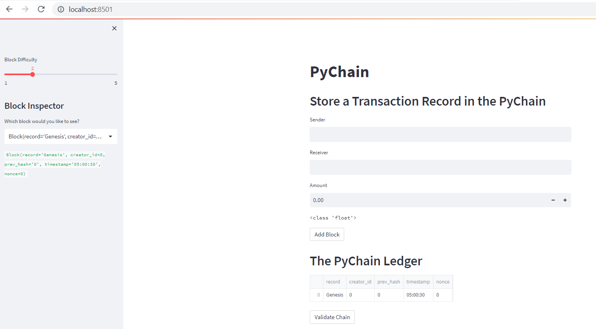
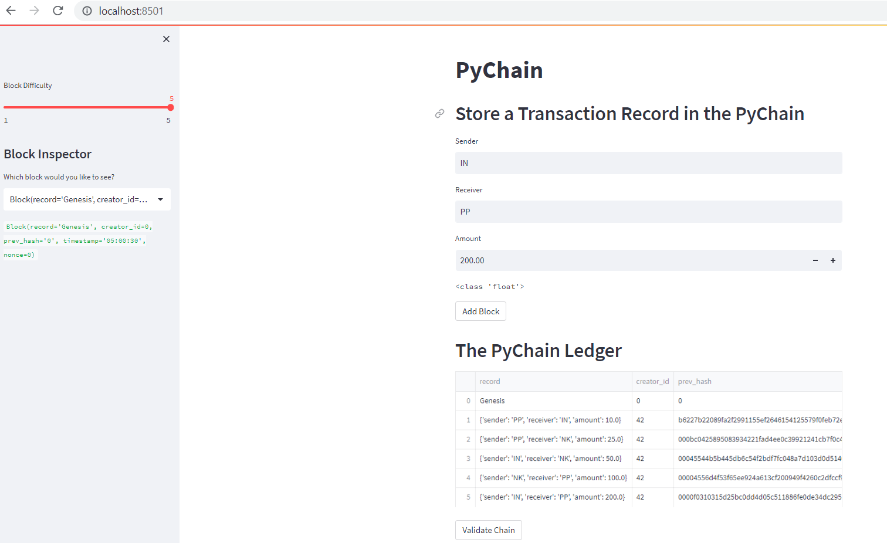
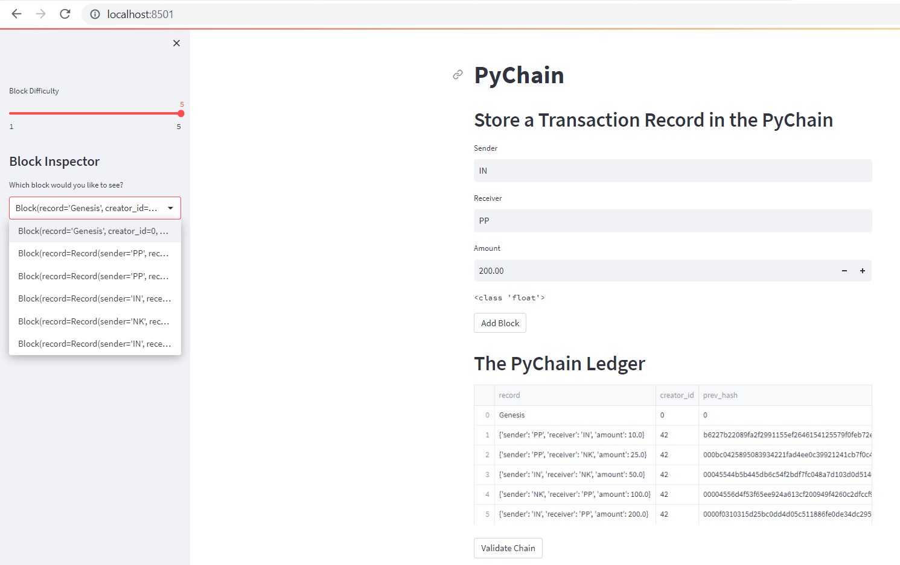
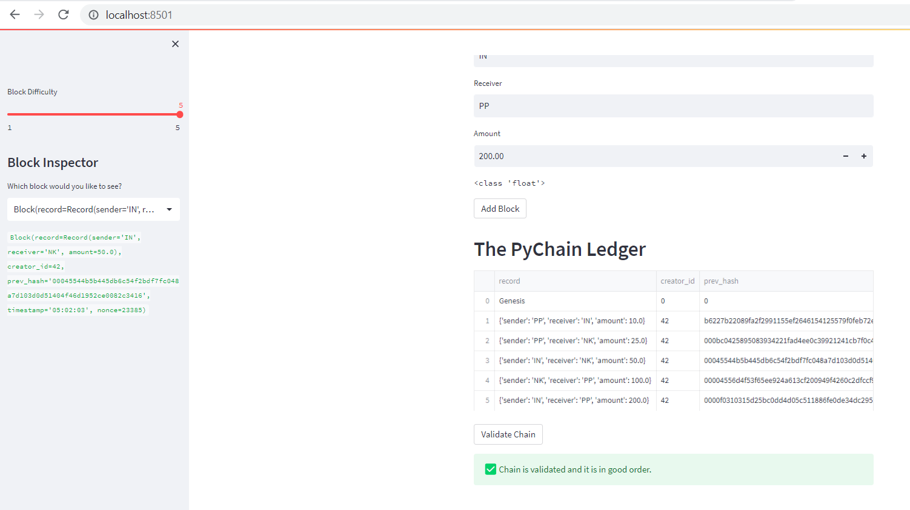

# Module 18
## Blockchain-based ledger system

 
---
> This program creates a user-friendly web interface to build a blockchain-based ledger system. 
> This ledger allows partner banks to conduct financial transactions (i.e. to transfer money between senders and receivers and to verify the integrity of the data in the ledger).
---

The goal of the program is to achieve following:
* Define Record and Block classes
* Create chain class that has validation and proof of work functions
* Add streamlit code for user-friendly web interface

## Technologies

> Program uses Python 3.7.x version and Jupyter Lab
> Program uses libraries: hashlib (to hash the block), streamlit (to build web interface) and dataclasses (to create classes)

---

## Installation Guide 

Please install packages: Streamlit and Dataclasses using PIP Install {pkg}.

---
## Usage

Invoke the web interface as follows:

> streamlit run pychain.py

---
## Contributors

Main author is : Pravin Patil. His linkedin profile is [Profile](https://www.linkedin.com/in/pravin-patil-5880301)

---

## License

Open